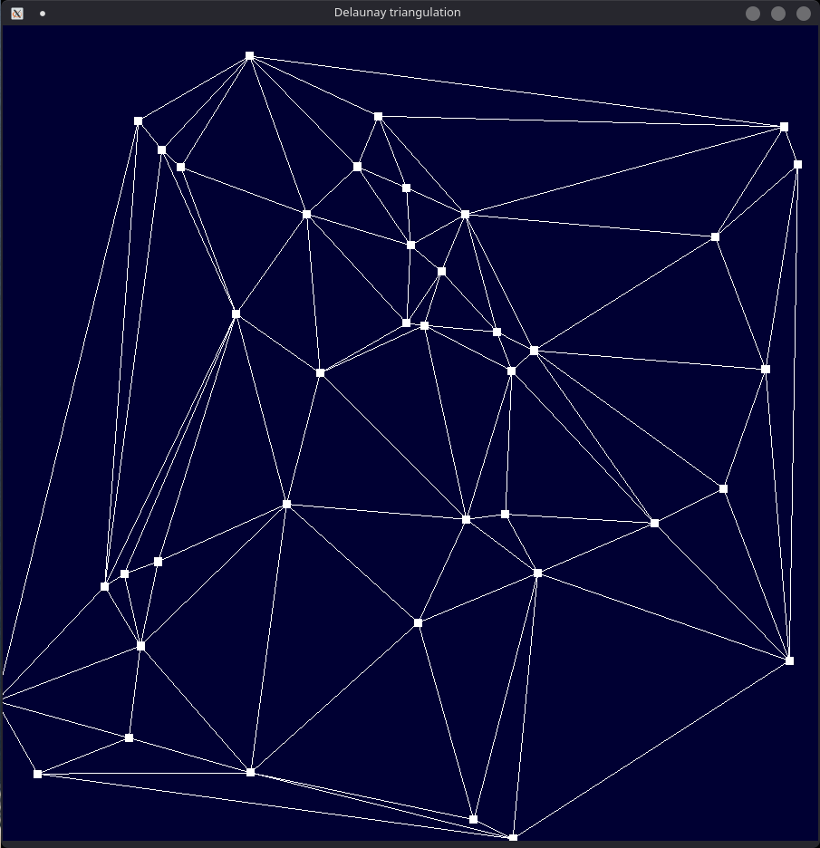
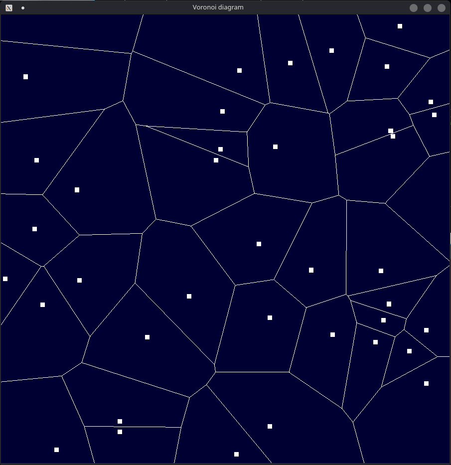
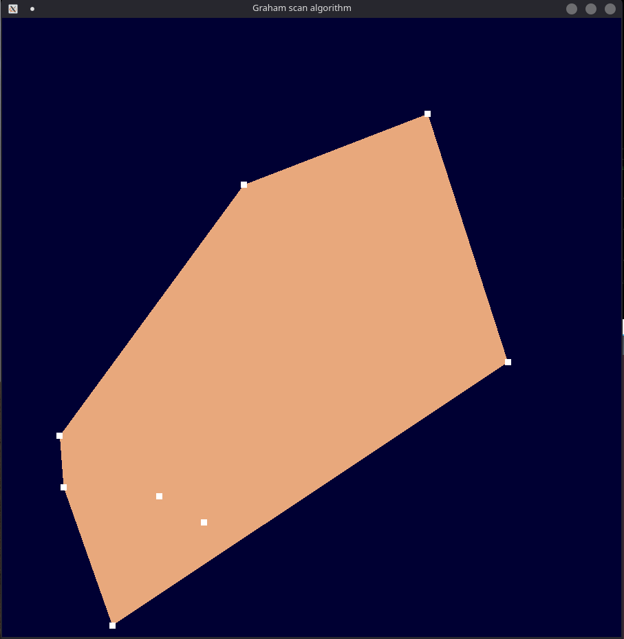

# Convex Hull algorithms lib and Voronoi diagram and Delaunay triangulation visualization
Program/Lib for C++ provides some algorithms to compute convex hull for given points, as well as a test program to verify them. It also provides visualization of Voronoi diagram and Delaunay triangulation.

